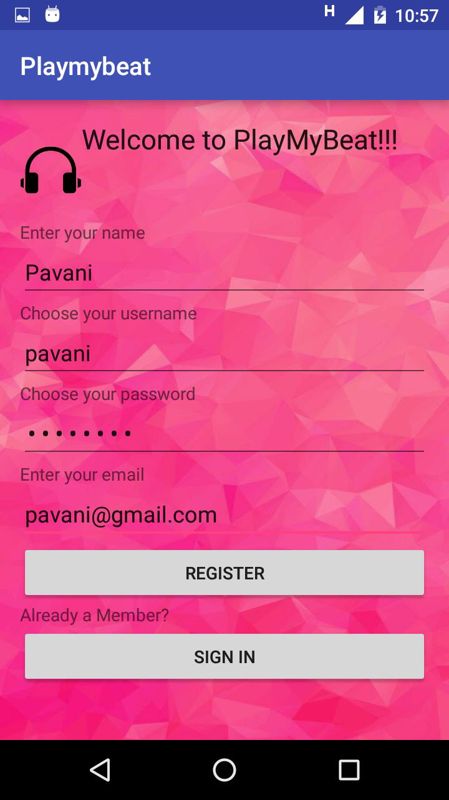
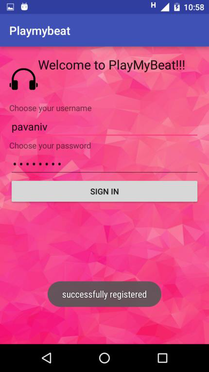
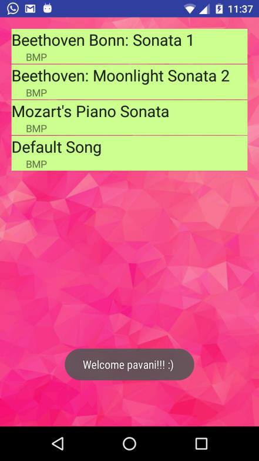
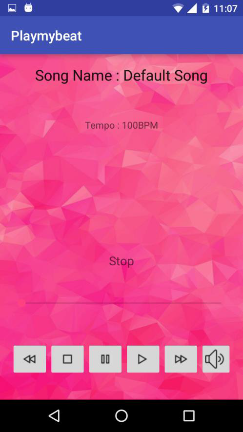
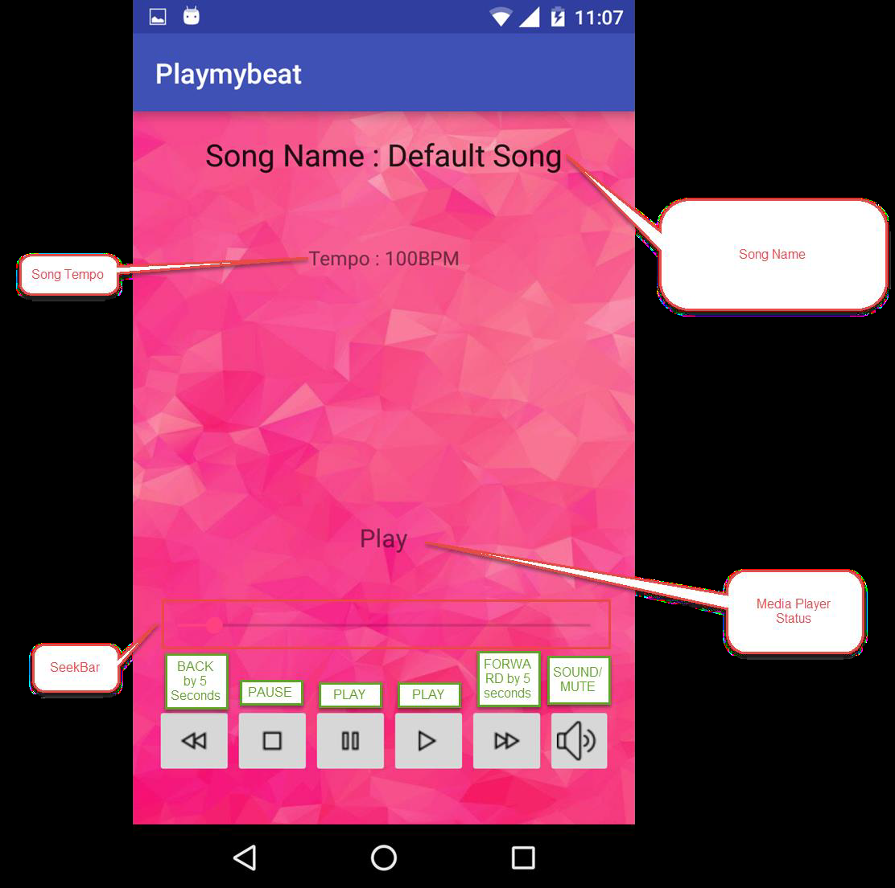

# PlayMyBeat

A Customized Media Player App on Android that streams music from a list of MP3 files stored in a cloud. Each user is authenticated to only access files that they have uploaded. 

## Synopsis

PlayMyBeat is a Customized Media Player App on Android that streams music from a list of MP3 files stored online. The application allows user’s to upload their favorite song or reference the URL links of MP3 files to their songs. The users’ information and the list of songs chosen is stored in a cloud database that is referred by the application. Each user will only be shown a Play List that he has created for himself with all this favorite songs and one default song.
The Application has a “Registration” and a “Sign in” Page that helps customize the application for different users.
PlayMyBeat is a wonderful Media Player Application that helps you stream your favorite music without having to download and save it in your phone.

## App running

#### Registration

#### Signin

#### Playlist

#### Media Player

## Technologies Used
Android SDK Version 23
o Media Player : android.media.MediaPlayer object created
o HTTP URL Connection : java.net.HttpURLConnection libraries used
o AsyncTask : To handle long running tasks
o Input Stream Reader & Buffer Reader : To receive the contents such as messages and JSON objects received from the server.
JDK 7
JRE 7
PHP : Scripting language used to get data from Application and process data to application
JSON : JSON format used to interact with the server and the database.
HTTP Protocols : GET and POST Methods used for communication.

## System Requirement
Android Minimum Version : Ice Cream Sandwich (4.0–4.0.4)
SDK Version
o Min SDK Version : 15
o Target SDKVersion : 23
Hardware Requirement : Touch Screen, Sound
Application Tested on : Motorolla G2 (Marshmallow Update

## Features
#### Registration
o Parameters
- Name
- Username
- Password
- EmailID
o A user has to register himself to be able to use the application.
o The details received in the registration page are first sent to the server and validated to check if a similar record already exists.
o If not then the user is registered.
#### Sign in
o Parameters
- Username
- Password
o Takes the details and authenticates with the data available in the database
#### Play List
o List of Songs Added by the User will be displayed in a custom list view.
o The selected song from the list view will openup in the built in media player.
#### Media player
o Play : Plays the selected Song
o Pauses : Pauses the song and saves the current position to restart from that location
o Stop : Stops the application and the current position is reset to initial position
o Forward : Jumps the song forward by 5 seconds from the current position
o Back : Jumps the song forward by 5 seconds from the current position
o SeekBar : Shows the current position of the song
o Song name : Displays the name of the song playing in the top
o BPM : Displays the beats / min of the song

## Motivation

This media player allows you to save your own music files and play them without having to use phone memory. Unline most other media players that only allows you to select from their database. This app allows to create your own database of songs and plays from it.

## API Reference

Created API for authentication in PHP

## License

Pavani Vellal @2017